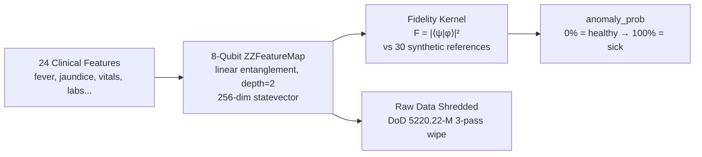
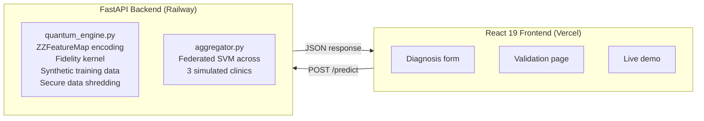

<div align="center">

# QuantumDx

### Privacy-First Quantum Disease Diagnosis

[](https://python.org)
[](https://qiskit.org)
[](https://react.dev)
[](https://fastapi.tiangolo.com)
[](https://railway.app)
[](https://vercel.com)
[](#testing)
[](LICENSE)

**Encode patient symptoms into quantum states. Diagnose disease with quantum fidelity. Destroy the raw data forever.**

[Live Demo](https://quantumdx.vercel.app) | [API Docs](https://h4h2026-production.up.railway.app/docs)

---

*Built for [Hack for Humanity 2026](https://www.hackforhumanity.io/) — targeting leptospirosis screening at community health posts in Kisumu County, Kenya.*

</div>

---

## The Problem

In rural Kenya, **leptospirosis** kills through misdiagnosis. Community health workers lack lab infrastructure, and sending patient data to centralized systems creates privacy risks in regions with limited data protection.

**QuantumDx** solves both problems at once: it uses quantum computing to diagnose disease from symptoms alone, then **permanently destroys** the raw patient data — leaving only a quantum fingerprint that cannot be reverse-engineered.

## How It Works



### The Quantum Pipeline

1. **Condense** — 24 raw clinical features (17 symptoms + 7 vitals/labs) are compressed into 8 composite features mapped to `[0, π]`
2. **Encode** — Each composite drives one qubit of an 8-qubit [ZZFeatureMap](https://docs.quantum.ibm.com/api/qiskit/qiskit.circuit.library.ZZFeatureMap) circuit with linear entanglement
3. **Simulate** — Statevector simulation produces a 256-dimensional complex vector (the "quantum fingerprint")
4. **Classify** — Fidelity kernel `F(ψ,φ) = |⟨ψ|φ⟩|²` compares the patient state against 30 synthetic reference patients (15 healthy, 15 sick)
5. **Shred** — Raw patient data is overwritten using DoD 5220.22-M 3-pass secure erasure

> The quantum fingerprint is **one-way** — you cannot recover the original symptoms from the statevector.

## Validation Results

Tested on **141 real leptospirosis patients** from Kisumu County, Kenya:

| Metric | Value |
|:-------|:------|
| **Accuracy** | 79% (111/141) |
| **Sensitivity** | 60% (34/57 positives caught) |
| **Specificity** | 92% (77/84 negatives cleared) |

```
                Predicted
              Neg     Pos
Actual Neg │  77   │   7  │  92% specificity
Actual Pos │  23   │  34  │  60% sensitivity
```

High specificity (92%) means fewer false alarms — critical for resource-constrained clinics where every referral costs time and money.

## Architecture



### Tech Stack

| Layer | Technology |
|:------|:-----------|
| **Quantum Engine** | Qiskit 2.2 (ZZFeatureMap, Statevector) |
| **Backend API** | FastAPI + Uvicorn |
| **Frontend** | React 19, TypeScript, Vite, Framer Motion |
| **ML** | scikit-learn (SVM kernel), NumPy |
| **Federated Learning** | Custom weighted aggregation across 3 clinics |
| **Deployment** | Railway (API) + Vercel (Frontend) |
| **Data** | 498 real patients from Kisumu County leptospirosis dataset |

## Privacy Model

QuantumDx implements **privacy-by-destruction**:

1. **Encode** — Raw symptoms are transformed into quantum state parameters
2. **Shred** — The original data file is overwritten 3 times (DoD 5220.22-M standard), then deleted
3. **Retain** — Only the quantum fingerprint (8 normalized parameters in `[0, π]`) is stored
4. **Irreversible** — The condensation function is many-to-one; multiple symptom profiles map to the same quantum state

No raw patient data leaves the device. No raw patient data is stored. The quantum state is all that remains.

## Federated Learning

Three simulated clinics (A, B, C) each train local quantum SVM models on their own patient subsets. The **aggregator** merges their decision boundaries using weighted averaging — no raw data is shared between clinics.

```
Clinic A (local model) ──┐
Clinic B (local model) ──┼──> Weighted SVM Aggregation ──> Global Model
Clinic C (local model) ──┘
```

## Getting Started

### Prerequisites

- Python 3.12+
- Node.js 18+

### Backend

```bash
# Install dependencies
pip install -r requirements.txt

# Start the API server
uvicorn api:app --reload --port 8000

# API docs at http://localhost:8000/docs
```

### Frontend

```bash
cd "Web App"
npm install
npm run dev

# Opens at http://localhost:5173
```

### Streamlit UI (alternative local interface)

```bash
streamlit run app.py
```

### Validation

```bash
# Run the 24-patient cherry-picked demo
python demo.py

# Run full test suite (25 tests)
pytest tests/ -v
```

## API Endpoints
| Method | Endpoint                              | Description         |
| ------ | ------------------------------------- | ------------------- |
| `POST` | `/patients`                           | Add patient         |
| `POST` | `/diagnose`                           | Diagnose patient    |
| `POST` | `/patients/label`                     | Label patient       |
| `POST` | `/retrain`                            | Retrain model       |
| `GET`  | `/models/current`                     | Current model       |
| `GET`  | `/feature-store/summary`              | Feature store stats |
| `POST` | `/patients/ingest-from-sql/{user_id}` | SQL ingestion       |
| `GET`  | `/metrics`                            | Prometheus metrics  |
| `GET`  | `/health`                             | Health check        |


### Example: Diagnose a Patient

```bash
curl -X POST https://h4h2026-production.up.railway.app/predict \
  -H "Content-Type: application/json" \
  -d '{
    "fever": true,
    "jaundice": true,
    "vomiting": true,
    "muscle_pain": true,
    "headache": true,
    "heart_rate": 110,
    "bp_systolic": 90,
    "wbc": 15000,
    "platelets": 80000
  }'
```

## Project Structure

```
QuantumDx/
├── agents/                  # Modular pipeline agents
├── mlops/                   # CDC + bulk loader
├── streaming/               # Kafka + Event Hub ingestion
├── observability/           # OpenTelemetry + logging
├── api.py                   # FastAPI app
├── quantum_engine.py        # Quantum encoding
├── aggregator.py            # Federated learning
├── tests/                   # Full pytest suite
├── data/
└── Web App/
```

## Testing

```bash
pytest tests/ -v
```

```
tests/test_quantum_engine.py      ✓  Encoding, fidelity, synthetic data
tests/test_api.py                 ✓  REST endpoints, prediction flow
tests/test_aggregator.py          ✓  Federated SVM aggregation
tests/test_classical_benchmark.py ✓  Baseline model comparison
────────────────────────────────────
25 passed
```

## Dataset

**498 leptospirosis patients** from Kisumu County, Kenya (cleaned from 1,734 raw records). Features include:

- **17 binary symptoms**: fever, jaundice, vomiting, confusion, muscle pain, headache, chills, rigors, nausea, diarrhea, cough, bleeding, prostration, oliguria, anuria, conjunctival suffusion, muscle tenderness
- **7 continuous values**: heart rate, systolic BP, diastolic BP, age, sex, WBC count, platelet count

## Deployment

| Service | Platform | Trigger |
|:--------|:---------|:--------|
| Backend API | Railway | Auto-deploy on push to `main` |
| Frontend | Vercel | `cd "Web App" && npx vercel --prod` |

---

<div align="center">

**Built at [Hack for Humanity 2026](https://www.hackforhumanity.io/)**

*Quantum diagnostics for the communities that need them most.*

</div>
