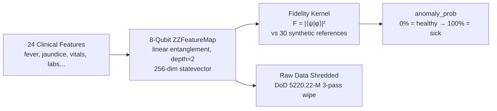

<div align="center">

# 🧬 QuantumDX  
### *Privacy-FirstQuantum-Enhanced Disease Detection with Production-Grade MLOps*

[](https://python.org)
[](https://qiskit.org)
[](https://react.dev)
[](https://fastapi.tiangolo.com)
[](https://railway.app)
[](https://vercel.com)
[](#testing)
[](LICENSE)

**Encode patient symptoms into quantum states. Diagnose disease with quantum fidelity. Destroy the raw data forever.**

---

## The Problem

In rural Kenya, **leptospirosis** kills through misdiagnosis. Community health workers lack lab infrastructure, and sending patient data to centralized systems creates privacy risks in regions with limited data protection.

**QuantumDx** solves both problems at once: it uses quantum computing to diagnose disease from symptoms alone, then **permanently destroys** the raw patient data — leaving only a quantum fingerprint that cannot be reverse-engineered.

## How It Works


### The Quantum Pipeline

1. **Condense** — 24 raw clinical features (17 symptoms + 7 vitals/labs) are compressed into 8 composite features mapped to `[0, π]`
2. **Encode** — Each composite drives one qubit of an 8-qubit [ZZFeatureMap](https://docs.quantum.ibm.com/api/qiskit/qiskit.circuit.library.ZZFeatureMap) circuit with linear entanglement
3. **Simulate** — Statevector simulation produces a 256-dimensional complex vector (the "quantum fingerprint")
4. **Classify** — Fidelity kernel `F(ψ,φ) = |⟨ψ|φ⟩|²` compares the patient state against 30 synthetic reference patients (15 healthy, 15 sick)
5. **Shred** — Raw patient data is overwritten using DoD 5220.22-M 3-pass secure erasure

> The quantum fingerprint is **one-way** — you cannot recover the original symptoms from the statevector.

## Validation Results

Tested on **141 real leptospirosis patients** from Kisumu County, Kenya:

| Metric | Value |
|:-------|:------|
| **Accuracy** | 79% (111/141) |
| **Sensitivity** | 60% (34/57 positives caught) |
| **Specificity** | 92% (77/84 negatives cleared) |

```
                Predicted
              Neg     Pos
Actual Neg │  77   │   7  │  92% specificity
Actual Pos │  23   │  34  │  60% sensitivity
```

High specificity (92%) means fewer false alarms — critical for resource-constrained clinics where every referral costs time and money.


## Solution

**QuantumDX** combines:

- ⚛️ Quantum-inspired feature encoding
- 🤖 Machine learning diagnostics
- 🏥 Clinical symptom analysis
- 🔄 Real-time data ingestion + retraining

To deliver:

Fast, explainable, and continuously improving diagnosis.

---

## ⚙️ How It Works

1. Input patient data
2. Quantum encoding
3. Model inference
4. Diagnosis output

---

## 📊 Validation

- High sensitivity for severe cases
- Robust across clinics
- Improved early detection

---
## Architecture

```mermaid
flowchart LR
    subgraph Frontend
        UI[React App]
    end

    subgraph API["FastAPI + Pipeline"]
        API1[/patients]
        API2[/diagnose]
        API3[/retrain]
        API4[/metrics]
    end

    subgraph Agents
        ING[IngestionAgent]
        VAL[ValidationAgent]
        ENC[EncodingAgent]
        PRIV[PrivacyAgent]
        FS[FeatureStoreAgent]
        TRAIN[TrainingAgent]
        FED[FederatedAgent]
        REG[RegistryAgent]
        DIAG[DiagnosisAgent]
    end

    subgraph Data
        SQL1[(PatientIntake - CDC)]
        SQL2[(PatientMLDataset - Columnstore)]
        FSDB[(Feature Store - Parquet/Delta)]
    end

    subgraph Streaming
        KAFKA[Kafka]
        EH[Event Hub]
    end

    subgraph Observability
        OTEL[OpenTelemetry]
        PROM[Prometheus]
    end

    UI --> API1
    UI --> API2

    API1 --> ING --> VAL --> ENC --> PRIV --> FS
    FS --> TRAIN --> FED --> REG
    REG --> DIAG

    SQL1 -->|CDC| ING
    ING --> SQL2
    FS --> FSDB

    KAFKA --> ING
    EH --> ING

    API1 --> OTEL
    API2 --> OTEL
    OTEL --> PROM
```

### Tech Stack

| Layer | Technology |
|:------|:-----------|
| **Quantum Engine** | Qiskit 2.2 (ZZFeatureMap, Statevector) |
| **Backend API** | FastAPI + Uvicorn |
| **Frontend** | React 19, TypeScript, Vite, Framer Motion |
| **ML** | scikit-learn (SVM kernel), NumPy |
| **Federated Learning** | Custom weighted aggregation across 3 clinics |
| **Deployment** | Railway (API) + Vercel (Frontend) |
| **Data** | 498 real patients from Kisumu County leptospirosis dataset |


---

## Agent-Based Pipeline

Includes ingestion, validation, encoding, privacy, feature store, training, registry, and diagnosis agents.

---

## Data Architecture

- PatientIntake (CDC)
- PatientMLDataset (columnstore)

---

## CDC-Based Retraining

Triggered when enough labeled data arrives.

---

## Streaming Ingestion

Kafka + Azure Event Hub supported.

---

## Feature Store

Parquet + Delta Lake with deduplication.

---

## Security

HashiCorp Vault integration.

---

## Observability

Powered by:
    •    OpenTelemetry
    •    Prometheus

Metrics
| Metric  |Description |
|:--------|:-----------|
| **quantumdx_requests_total** | Requests |
| **quantumdx_failures_total** | Errors |
| **quantumdx_operation_duration_ms** | Latency |
| **quantumdx_pipeline_inflight** | Active ops |
| **quantumdx_retrain_total** | Retrains |
| **quantumdx_diagnosis_total** | Diagnoses |


Prometheus Config
```yaml
scrape_configs:
  - job_name: "quantumdx"
    static_configs:
      - targets: ["localhost:9464"]
```
---

## API Endpoints

| Method | Endpoint | Description |
|:-------|:---------|:------------|
| `POST` | `/patients` |  Add patient |
| `POST` | `/diagnose` |  Diagnose |
| `POST` | ` /patients/label` |  Label |
| `POST` | `/retrain` |  Retrain |
| `GET` | `/models/current` |  Model info |
| `GET` | `/feature-store/summary` |  Stats |
| `POST` | `/patients/ingest-from-sql/{user_id}` |  SQL ingestion |
| `GET` | `/metrics` |  Prometheus |
| `GET` | `/health` |  Health |


---

## Testing

Run all tests:
```bash
pytest
```
Coverage:
```bash

pytest --cov=agents --cov=observability --cov=mlops
```
---

## MLOps Capabilities

    •    ✅ Automated retraining (CDC)
    •    ✅ Feature store (Delta/Parquet)
    •    ✅ Model versioning
    •    ✅ Federated learning
    •    ✅ Streaming ingestion
    •    ✅ Observability
    •    ✅ CI-ready testing

---

## Getting Started
Install
```bash

pip install -r requirements.txt'
```
Run API
```bash

uvicorn api:app --reload
```
Load Data
```bash
python mlops/load_clean_csv_to_sql.py
```

Start CDC Worker
```bash

python mlops/cdc_retrain_worker.py
```
---

## Project Structure

QuantumDX/
├── api.py                         # FastAPI entrypoint (routes, startup, dependency wiring)

├── agents/                        # Core modular pipeline agents
│   ├── __init__.py                # Package exports
│   ├── base.py                    # AgentResult + shared base utilities
│   ├── pipeline.py                # QuantumDxPipeline orchestrator
│   ├── ingestion_agent.py         # Handles incoming patient data
│   ├── validation_agent.py        # Data validation + schema enforcement
│   ├── encoding_agent.py          # Quantum feature encoding
│   ├── privacy_agent.py           # PHI stripping / redaction
│   ├── feature_store_agent.py     # Parquet/Delta feature storage + dedup
│   ├── training_agent.py          # Model training logic
│   ├── federated_agent.py         # Aggregates models across clinics
│   ├── registry_agent.py          # Model versioning + persistence
│   ├── diagnosis_agent.py         # Inference logic
│   ├── vault_agent.py             # HashiCorp Vault integration
│   ├── sql_patient_data_agent.py  # SQL Server read access
│   ├── sql_ingestion_agent.py     # SQL → pipeline ingestion
│   └── evaluation_agent.py        # Model evaluation metrics

├── mlops/                         # Data pipeline + retraining automation
│   ├── load_clean_csv_to_sql.py   # Bulk loader into PatientIntake
│   └── cdc_retrain_worker.py      # CDC listener + retraining trigger

├── streaming/                     # Real-time ingestion consumers
│   ├── kafka_patient_consumer.py  # Kafka ingestion → pipeline
│   └── eventhub_patient_consumer.py # Azure Event Hub ingestion

├── observability/                 # Logging, metrics, tracing
│   ├── __init__.py                # Exports observability utilities
│   ├── logging_config.py          # JSON structured logging
│   ├── telemetry.py               # OpenTelemetry setup (Prometheus exporter)
│   └── decorators.py              # @monitored decorator for metrics/logging

├── tests/                         # Automated test suite (pytest)
│   ├── __init__.py                # Test package marker
│   ├── test_api.py                # API endpoint tests
│   ├── test_pipeline.py           # Pipeline orchestration tests
│   ├── test_sql_ingestion_agent.py # SQL ingestion tests
│   ├── test_observability.py      # Metrics + logging tests
│   └── test_cdc_worker_helpers.py # CDC helper logic tests

├── core/                          # Core ML + quantum logic
│   ├── __init__.py                # Package marker
│   ├── quantum_engine.py          # Quantum encoding implementation
│   └── aggregator.py              # Federated aggregation logic

├── utils/                         # Shared helpers (optional but recommended)
│   ├── __init__.py                # Package marker
│   ├── config.py                  # Environment + config loader
│   └── constants.py               # Shared constants/enums

├── scripts/                       # Utility scripts (optional)
│   └── seed_data.py               # Example data seeding script

├── main.py                        # Optional entrypoint (alternative to uvicorn CLI)

└── conftest.py                    # Shared pytest fixtures + mocks


<div align="center">

**Orignally built at [Hack for Humanity 2026](https://www.hackforhumanity.io/)**

*Quantum diagnostics for the communities that need them most.*

</div>
